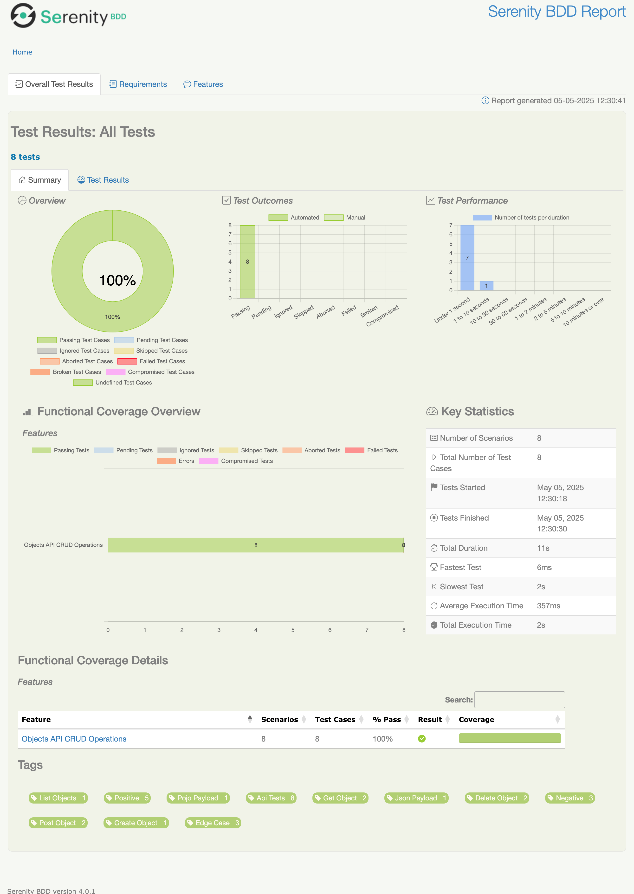

# NatWest API Automation Take-Home Task

This project contains an automated test suite for the `restful-api.dev` API, developed as part of a take-home task. It utilizes Java, Serenity BDD, Rest Assured, Cucumber, Gradle, and JUnit to perform CRUD (Create, Read, List, Delete) operations on API objects.

## Project Structure

The project follows a standard Maven/Gradle structure for Java projects:

```
project-root/
├── .gradle/                       # Gradle internal files (auto-generated)
├── build/                         # Compiled code and build artifacts (auto-generated)
├── gradle/
│   └── wrapper/
│       ├── gradle-wrapper.jar     # Gradle Wrapper executable JAR
│       └── gradle-wrapper.properties  # Gradle Wrapper configuration
├── src/
│   └── test/
│       ├── java/
│       │   └── com/
│       │       └── natwest/
│       │           └── automation/
│       │               ├── model/       # POJO classes (e.g., ObjectData.java)
│       │               ├── runners/     # Cucumber JUnit test runners (e.g., TestRunner.java)
│       │               ├── steps/       # Step definition classes (e.g., ObjectApiSteps.java)
│       │               └── utils/       # Utility/helper classes (if any)
│       └── resources/
│           ├── features/                # Cucumber feature files (e.g., objects_api.feature)
│           └── serenity.properties      # Serenity BDD configuration
├── .gitignore                        # Git ignore file
├── build.gradle                      # Gradle build script
├── gradlew                           # Gradle wrapper script (Linux/macOS)
├── gradlew.bat                       # Gradle wrapper script (Windows)
└── README.md                         # Project readme/documentation
```

## Technologies Used

*   **Java 11:** Programming language.
*   **Gradle 8.1.1:** Build automation tool.
*   **Serenity BDD (4.0.1):** BDD framework for reporting and managing test execution.
*   **Rest Assured (5.3.0):** Java library for testing RESTful APIs.
*   **Cucumber (7.11.1):** BDD tool for writing tests in Gherkin syntax.
*   **JUnit 5 (5.9.2):** Testing framework for running tests.
*   **SLF4j + Logback:** Logging framework.
*   **Jackson:** JSON processing library.
*   **AssertJ:** Fluent assertions library (optional but included).

## Features Implemented

The test suite covers the following scenarios defined in `src/test/resources/features/objects_api.feature`:

*   **Positive Scenarios:**
    *   Successfully creating a new object (POST /objects).
    *   Successfully retrieving an existing object by ID (GET /objects/{id}).
    *   Successfully listing multiple objects (GET /objects).
    *   Successfully deleting an existing object by ID (DELETE /objects/{id}).
*   **Negative/Edge Case Scenarios:**
    *   Attempting to create an object with missing mandatory fields (Note: API returns 200 OK, indicating it doesn't enforce all fields).
    *   Attempting to retrieve an object with an invalid/non-existent ID (expecting 404 Not Found).
    *   Attempting to delete an object with an invalid/non-existent ID (expecting 404 Not Found).

## Setup and Execution

### Prerequisites

1.  **JDK 11 or higher:** Ensure you have a compatible Java Development Kit installed. You can check your version with `java -version`.
2.  **Internet Connection:** Required for Gradle to download dependencies.

### Steps to Run Tests

1.  **Unzip the Project:** Extract the contents of the `natwest-api-automation.zip` file to a location on your computer.
2.  **Open Terminal/Command Prompt:** Navigate into the root directory of the extracted project (`natwest-api-automation`).
3.  **Run Tests using Gradle Wrapper:**
    *   On Linux/macOS: Execute `./gradlew clean test`
    *   On Windows: Execute `gradlew.bat clean test`

    *Explanation:*
    *   `./gradlew` or `gradlew.bat`: Executes the Gradle wrapper, which automatically downloads and uses the correct Gradle version (8.1.1) specified for the project, ensuring build consistency.
    *   `clean`: Cleans the previous build outputs.
    *   `test`: Compiles the code and runs the tests defined in the `TestRunner` class, which in turn executes the Cucumber features.

4.  **View Reports:** After the tests finish execution, Gradle and Serenity BDD will generate reports.
    *   **Serenity Report:** The primary, detailed HTML report can be found at:
        `target/site/serenity/index.html`
        Open this file in your web browser to view comprehensive test results, including step details, execution times, and requirements coverage.
    *   **JUnit XML Report:** Located at `target/cucumber-reports/cucumber.xml`.
    *   **Basic Cucumber HTML Report:** Located at `target/cucumber-reports/cucumber-html-report.html`.
    *   **JSON Report:** Located at `target/cucumber-reports/cucumber.json`.

## Code Highlights

*   **Clean Code:** Efforts were made to follow clean code practices, including meaningful naming, clear method structures, and comments explaining the purpose of code sections.
*   **BDD with Cucumber:** Scenarios are written in Gherkin syntax in `.feature` files, promoting collaboration and clear understanding of test goals.
*   **Step Definitions:** The `ObjectApiSteps.java` class links the Gherkin steps to Java code that interacts with the API using Rest Assured and SerenityRest.
*   **Data Sharing:** The `createdObjectId` instance variable in `ObjectApiSteps` is used to share the ID of a created object between steps within the same scenario (e.g., create then get, create then delete).
*   **JSON Path Assertions:** Hamcrest matchers and Rest Assured's `jsonPath()` are used for validating API responses, including checking specific fields using JSON Path expressions (e.g., `response.then().body("data.price", equalTo(...))`).
*   **Edge Cases:** Specific scenarios are included to test invalid inputs and error conditions (e.g., invalid IDs, missing data).
*   **Configuration:** The API base URL is configurable via the `serenity.base.url` system property (set in `build.gradle`) or can be overridden.
*   **Gradle Wrapper:** Ensures consistent builds across different environments by using the specified Gradle version.

## Report Highlight
